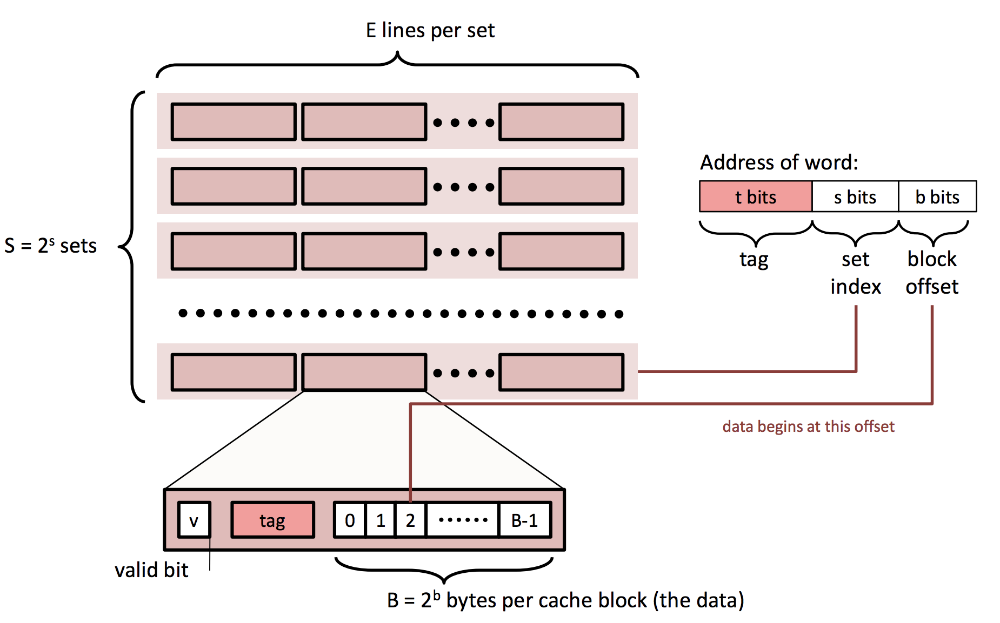
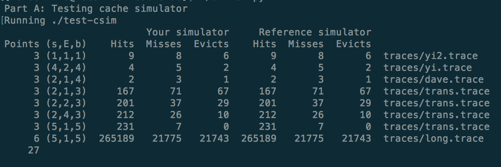
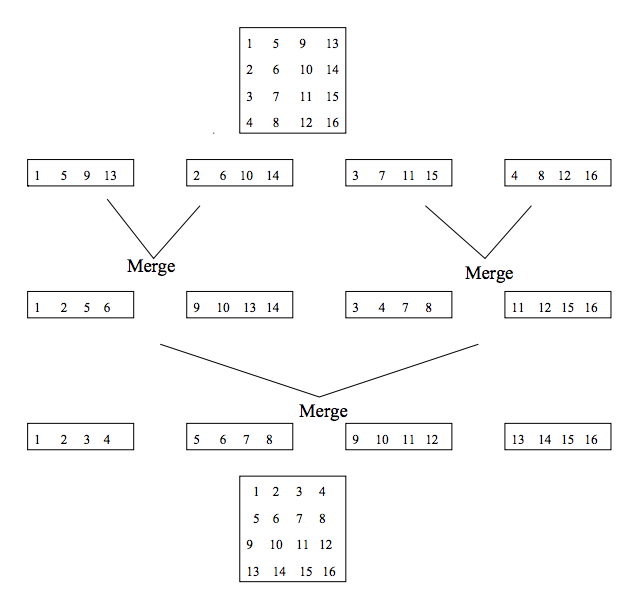

# CacheLab

### Part A C语言编程模拟Cache Memory

#### 高速缓存的结构



在高速缓存中，我们把一块缓存分成$S=2^s$个CacheSet，然后每个CacheSet中含有$E$个CacheLine，CacheLine就是在这个模型中最小的存储索引结构，含有tag，valid，block数据。他们的数据结构实现为：

```c
struct CacheLine{
    int valid;
    unsigned long long int  tag;
    char *data;
    int last_time;
};

struct CacheSet{
    struct CacheLine *lines;
}; 

struct Cache{
    struct CacheSet *sets;
};
```

数据结构从小往大设计，而初始化需要从大往小进行。

在c++中，我们可以使用`cache.sets = new CacheSet [par.S]`的语句来分配储存空间，但是在c中需要用malloc；另外，c中没有对象，不能对cache进行统一的封装，否则应该写一个大的Cache类把参数、函数都封装起来。

```c
struct Cache initCache(struct CacheParameter par){
    struct Cache cache;
    cache.sets = (struct CacheSet*) malloc(sizeof(struct CacheSet) * par.S);
    for(int i=0; i<par.S; i++){
        cache.sets[i].lines = (struct CacheLine*) malloc(sizeof(struct CacheLine) * par.E);
        for(int j=0; j< par.E; j++){
            cache.sets[i].lines[j].valid = 0;
            cache.sets[i].lines[j].tag = 0;
            cache.sets[i].lines[j].last_time = 0;
        }
    }
    return cache;
}
```

#### 数据读入读出

我第一次处理这种读入读出模式，根据我找到的资料，最终利用getopt.h等工具的帮助写成：

```c
while( (c=getopt(argc,argv,"s:E:b:t")) != -1){
    switch(c){
        case 's':
            param.s = atoi(optarg);
            break;
        case 'E':
            param.E = atoi(optarg);
            break;
        case 'b':
            param.b = atoi(optarg);
            break;
        case 't':
            file = optarg;
            break;
    }
}
```

#### 内存管理逻辑

根据书上的算法，在内存已满的情况下，我们需要把最不常用的数据替换掉，这里就需要我们来维护一个全局的时钟，在程序初试的时候设定为0。首先，用类似哈希算法将每个地址映射到一个CacheSet，`id_set = (addr >> param.b) & (param.S -1)`，然后在这个CacheSet里面遍历一遍，看看有没有已经存过了此数据，如果没存过再找一个空缺的/不常用的位置存起来。

```c
unsigned int global_time;

int evictLine(struct CacheSet set) { 
    //sequencially find the oldest cache line and evict it, time O(E) linear
    int min, min_id;
    min = set.lines[0].last_time;
    min_id = 0;
    for (int i=1; i<param.E; i++) {
        if (min > set.lines[i].last_time) {
            min_id = i;	
            min = set.lines[i].last_time;
        }
    }
    return min_id;
}

void sim(struct Cache cache, unsigned long long int addr) {
    int empty = 0;

    unsigned long long int tag = addr >> (param.s + param.b);
    unsigned long long int id_set = (addr >> param.b) & (param.S -1);
        
    struct CacheSet cacheset = cache.sets[id_set];

    for (int i=0; i<param.E; i++) 	{          
        if (cacheset.lines[i].valid) {
            if (cacheset.lines[i].tag == tag) {
                cacheset.lines[i].last_time = global_time ++;
                param.hits ++;
                return;
            }
       } 
        else if (!(cacheset.lines[i].valid))
            empty = 1;
    }	

    param.misses++;

    int min_id = evictLine(cacheset);
    if (!empty){
        param.evicts++;
        struct CacheLine *l = &cacheset.lines[min_id];
        l->tag = tag;
        l->valid = 1;
        l->last_time = global_time++;
    }
    else{
        struct CacheLine *l = &cacheset.lines[nextCacheLine(cacheset)];
        l->tag = tag;
        l->valid = 1;
        l->last_time = global_time++;
    }						
}
```

#### 结果

这个Cache模拟器通过了所有的样例：



#### 体会与展望

- 缓存的结构十分有趣，底层的算法优化可以大幅度提升计算机的性能
- 此算法单纯通过历史访问时间来判断，如果给每个数据添加不同的权重，那么还有其他的算法来优化


- 在这个作业中，E比较小，而且并没有设置时间上的限制，寻找最不常用的CacheLine的算法的时间复杂度是根据E线性的。如果E比较大的话，可以通过树或者堆的结构来将这一查询的时间复杂度降低到$O(logE)$。

### Part B 优化矩阵转置

#### Cache分析

根据`test-trans.c`中的参数：

```c
/* Check the performance of the student's transpose function */
    eval_perf(5, 1, 5);
```

可以看到，这个cache是$S=32$，$E=1$，$B=32$，因为int是四子节的，所以每个CacheLine中会存储8个int。如果按照顺序排放，每个按列枚举的维度每八个数会重新load一遍，按行枚举的数每个都需要重新load一下，因此按这种情况得到的miss个数大约是$\frac{9n}{8}$，根据实验（样例）情况，也确实如此。

#### 分块

为了有更好的局部性，我给矩阵分块，得到的结果如下，不同的分块方式适用于不同的矩阵大小：

|          | 2*2  | 4*4  | 8*8  | 对角线优化 |
| -------- | ---- | ---- | ---- | ---------- |
| (32, 32) | 727  | 487  | 343  | 287        |
| (64, 64) | 2899 | 1891 | 4723 | 1795       |
| (61, 67) | 3154 | 2443 | 2225 | 2112       |

```c
if(M==32){
        for(block_i=0; block_i<32; block_i +=8){
            for(block_j=0; block_j<32; block_j +=8){
                for(i=block_i; i<block_i+8; i++){
                    for(j=block_j; j<block_j+8; j++)
                            B[j][i] = A[i][j]；							
                }
            }
        } 
    }
```

注意到对角线的元素不需要置换，所以我们可以更改求和顺序，使得性能提升一点，但是性能还是有一定的差距，特别是(64, 64)的矩阵。

```c
for (ii = 0; ii < M; ii += 8){
	for (jj = 0; jj < N; jj += 8){	
			for(i = ii; (i < M) && (i < ii + 8); i++){
					for(j=jj; (j<N) && (j < jj + 8); j++){
						if (i != j)
							B[i][j] = A[j][i];
						else{
							temp = A[j][i];
							d = r;
						}
					}
					if(ii == jj) 
						B[d][d] = temp;
			}
	}
}
```

#### Merge



注意到每个CacheLine里面可以存8个int，所以在如上分块的时候，可以进行连续两行之间的merge，来大幅度降低miss的数量。最终相比只有分块的情况下减少了大约两百多个miss。

#### Morton Ordering

影响缓存效率的一个原因在于，矩阵的存储中行是顺序存的，而列是间隔N存储的，在矩阵很大的情况下取一列的N个数会有N个miss。如果我们改变矩阵的index方式，可以缓解这个问题。但是因为实验要求不允许递归，所以我在提交的代码中并没有实现这个想法。

#### 结果


### 参考文献

- 《深入理解计算机系统》Randel E. Bryant, David R. O'Hallaron


- Anthony E. Nocentino and Philip J. Rhodes. 2010. Optimizing memory access on GPUs using morton order indexing. In *Proceedings of the 48th Annual Southeast Regional Conference* (ACM SE '10). ACM, New York, NY, USA, , Article 18 , 4 pages. DOI=http://dx.doi.org/10.1145/1900008.1900035
- Chatterjee, S & Sen, Sandeep. (2000). Cache-efficient matrix transposition. IEEE High-Performance Computer Architecture Symposium Proceedings. 195-205. 10.1109/HPCA.2000.824350. 